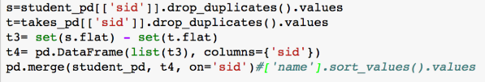

# CIS700 - 003 Midterm Preparation
> Exam Format:
* "Cheat Sheet": double-sided, can be typed
* Multiple-choice questions (for breadth)
* Smaller in-depth questions (for depth): may require bit of code (like PySpark) or explaining how to solve a problem w/ Pseudocode
- Content is material from homework, lectures, readings (emphasis on first two)

# 1/16 Lecture

### Challenges for Big Data
- Acquisition, access: needs to be accessible
- Wrangling: data may be in wrong form
- Integration, representation: data relationships may not be captured
- Cleaning, filtering: data may have variable quality
- Hypothesizing, querying, analyzing, modeling: from data to information
- Understanding, iterating, exploring: build knowledge from information
- Ethical obligations
	- Need to protect data, follow good statistical practices, present results in a non misleading way

___

# 1/18 Lecture
> Goal is Raw Data to Structured Data to Information to Knowledge

### Data Science - Myth & Reality
- __Myth__:
	- Learn "bottom up" using fancy statistics and machine learning
	- "Turn up crank" and pop out insights
- __Reality__: 
	- Rely on human expertise to impose models over the data
	- Deep learning for feature selection

## "Big" Data
- \* No clear consensus
- Too complex for humans to understand directly
- Doesn't fit single uniform memory space (variables in python)
- Need more than brute algorithms to analyze
- May require multiple computers
- Possible high dimensionality (feature selection and dimensionality reduction)

### Examples
- Netflix Prize
- High-Throughput Gene Sequencing
- Epileptic Seizure Prediction

### Overview
- Highly dimensional, hard to understand, requires understanding computation & IO costs
- Relies on extracting data and selecting __features__ and adding __semantic structure__ to data

## Structured Data
- __Logical representation__ of data that isn't dependent on
	+ Where things are located
	+ Specific in-memory data structures (array vs. linkedlist, tree vs. map)
	+ What pointers, indices are available
	+ "implicit" properties like order of access
- "__*Physical data independence*__":
	+ Led to relational database
	+ Needs abstraction more general than in-memory data structure
	+ Split across a cluster?
	+ Should allow for efficient bulk computation (filter, merge, extract)

### Data Frame
> Essentially a kind of table
> "think as a _relation_ across values or a _list of maps w/ the same keys/values_"

### Structured Data
- Camps of Big Data People:
	+ Programming languages and compiler developers
	+ Software engineers
	+ R and Matlab users
	+ Database developers and users
	+ MapReduce / Spark

___

# 1/25 Lecture

- Basic Abstraction: Dataframe
	+ Default: table w/ named columns and integer-identified rows
	+ `pandas.DataFrame.from_dict()`
	+ `pandas.read_csv()`
	+ `pandas.read_json()`

## Manipulating Data Frames
- Accessing Elements of DataFrame:
	- Rows as Tuples:
		+ `for iter in my_frame.iterrows():`
		+ `row = iter[1] // (v1, v2, v3...)`
	- Rows by Keys & Series
		+ `for col in my_frame:`
		+ `my_frame[col] // k-v`
	- Element by Index
		+ `my_frame.ix[0] // first row`
		+ `my_frame.ix[:,'first'] // first column`
		+ `my_frame.ix[0,'first'] // first cell`
- Setting Value: `my_frame.set+value(0, 'first', 1.0)` (sets `[0, 'first']` to `1.0`)

### Beyond Iteration
- Iteration in python is slow
- Order doesn't matter as long as final output combined the right way
- Way to do multiple operations at the same time?
	+ The basis of parallel computing, GPU computing, vector instructions, databases, MapReduce

### "Bulk" Operations over Structured Data Objects
- Extracting subsets of a DataFrame
	+ Selection / filtering: rows of certain data values
- Projection
	+ Want certain columns
- Composition of DataFrames:
	+ Concatenation: append a table to another
	+ Joining: merge rows

### Selecting Rows in DataFrame
- Can select rows by passing in Boolean vector of the same length
	+ `my_frame[[True, False, True]]`

### Getting Rid of Dirty Data
- DataFrames that use `NaN` to represent a "null" value
- `dropna`: remove rows
- `fillna`: substitute value

### Mapping elements of a collection
- Map each element by applying a function w `applymap`
- ex: `my_frame.applymap(my_fn)`

### Projecting Columns in a DataFrame
- `pd.DataFrame(my_frame['first'])`: frames of column `first`
- `pd.DataFrame(my_frame['first'] > 1.0)`: boolean column representing if which rows have `first` > 1.0
- `pd.DataFrame(my_frame(my_frame['first'] > 1.0))`: all rows where the condition `"first" > 1.0` is true

### Concatenating DataFrames
- `my_frame.append(my_frame2)`: concatenates rows of two frames
- `my_frame.append(my_frame2).drop_duplicates()`: concatenates rows of two frames without repeat rows

### Merging (Joining) Dataframes
- pseudo-code ex: matches all 'to' in left w 'from' in right
```python
dict_x = {'from': 1, 'to': 2}
left, right = pd.DataFrame.from_dict(dict_x)
left.merge(right, left_on=['to'], right_on='from')
```
- pseudo-code ex: non-matched are included with NaN on the un-matched column
```python
left.merge(right, left_on='to', right_on='from', how='outer', suffixes=('_l', '_r'))
```

### Restructuring the DataFrame
- Renaming column: `my_frame.rename(columns={'first':'spam'})`
- Changing index columns: `my_frame.reset_index()` or `my_frame.set_index('second')`
	- reset index keeps previous index as a new column
- Change column type: `pd.to_numeric(my_frame['third'], errors='coerce')` (forces NaN if non-numeric), `my_frame['second'].astype(str)`

### Operations
- Exist in other platforms too: SQL (relational algebra), MapReduce (specific patterns of map / reduce functions), Spark (combinations of patterns and built-in functions)

## Making DataFrames Persistent

- Store in DataBase to pass DF between programs / store excess data

### DFs and Databases
- Lingo:
```python
import sqlite3
engine = sqlite3.connect('my_database')
my_frame.to_sql('my_table', engine, if_exists='replace')
pd.read_sql('select * from my_table', engine)
```

### Choosing a DB
- SQL vs. NoSQL: 
	+ SQL offers transactional semantics / expects very regular structure
	+ NoSQL offers less clean support for updates but can offer faster queries as result
- MySQL vs. PostgreSQL vs. MongoDB
	+ Docker containers can install / use these quite easily

## Summarizing Data in Frames
- Basic capabilities for item-at-a-time traversal (discouraged) + operators for filtering, merging, etc

### Aggregating Computations Over Data
- __Grouping__ by some fields ("Show me the counts FOR EACH") into "bins"
- __Aggregation__: "compute the x for each bin"

### Groups & Indices [TODO]

### Re-ordering a DF
- `df.sort_values(['count', 'source'], ascending=False)`

## Visualizing DataFrames
`df['count'].plot(kind='line', title='Ayy')`

___

# 1/27 Recitation
> TODO

___

# 1/31 Lecture
- Huge DFs requiring expensive processing
	+ Put data on disk
	+ Distribute data and computation: across CPUs / GPUs + across machines (compute cluster or cloud center)
- Followup Challenges: retrieving data efficiently (even if changing in flight)
- Examples:
	+ Logs in Web company: platforms like DataDog, Apache Flume
	+ Order Processing / Analytics (Amazon)
	+ Ad analytics (Facebook, Google)
	+ Twitter meme / bot detection
	+ Search engine
	+ Facial / entity recognition from images
	+ Gene sequence matching pipelines
	+ Social network friend recommendation

## Challenges of Disk-bound Data
- Disk is slow (even SSD)
	+ Don't want to retrieve all data in order to do computation
	+ Need notation of __indexing__
- If queries + updates happen simultaneously, need to handle __concurrency__ via __isolation__	
-\* Requirements lead to __database management system__

## Data in a Database
- data is interrelated (notion of "schema")
- Ensures data is "clean" w constraints: notation of "key" (relationship w other tables through "foreign keys")
- Handles concurrent updates
- Improves performance by optimization

### Constraints
- Example: `Person(SSN, Name, DOB)`:
	+ SSN is 9-digit Integer
	+ Name is alpha-character string
	+ DOB is a date
- Key: set of fields that uniquely identify a tuple (Ex: SSN)

### Constraints as Relationships
- Relational databases have _"designed"_ relationships b/w tables (table w/ courses, names and departments, table w/ departments and building have relationship of department in both)

#### One-to-Many Relationship
- Ex: a department offers many courses
- Relational databases require __*atomic valued attributes*__ {cells}
	+ No complex types (lists, dictionaries)
	+ "First normal form"
- Relationships are encoded using keys (the "One") and foreign keys (the "Many")

#### Many-to-Many Relationships
- Ex: Students take many courses, courses are taken by many students
- Not every relationship is hierarchical
- JSON-embedded relationships vs. JSON-referenced relationships:
	+ Embedded will repeat a value multiple times (a student with their name, SID, etc) instead of just pointing to the data w a reference

## Querying Data: SQL

- Selecting Data:
	+ DF: `student_df[student_df["name"] == "Maya"]`
	+ SQL: `SELECT * FROM Student WHERE Name="Maya"`
- Projecting Columns:
	+ DF: `pd.DataFrame(student_df["Name"])`
	+ SQL: `SELECT (DISTINCT) Name FROM Student` (paren ~ optional)	
- Merging (Joining):
	+ DF: `pd.merge(student_df, takes_df, on="SID")`
	+ SQL: `SELECT Student.Name, Student.SID, Takes.Num FROM Student JOIN Takes ON Student.SID = Takes.SID` also `SELECT * FROM Student NATURAL JOIN`
- Grouping: "for each course, count the number of students"
	+ DF: `pd.DataFrame(takes_df.groupby(['Num']).size(),columns={'count'})`
	+ SQL: `SELECT Num, count(*) AS Count FROM Takes GROUP BY Num`
- Exists / Not-Exists: "Print all students who are not taking any course"
	+ SQL: `SELECT * FROM Student AS s WHERE NOT EXISTS (SELECT * FROM Takes AS t WHERE s.SID=t.SID)`
	+ DF:


## Working b/w DataFrames and Databases
- Data "in the wild" is in database
	+ Need to be able to _store_ DFs in a DB and _get_ from DB

### Relational Data Model
- Paper by __E. F. Codd__ [1970]: "relational model of data for large shared data banks"
	+ Separate physical implementation from logical
	+ Model the data independently from how it will be used (accessed, printed, etc)
		* Describe the data minimally and mathematically
		* use standard mathematical operations over the data (relational algebra, relational calculus)
- Optimization was key to relational systems
	+ [1969-70] Codd's original work
	+ [1976] Earliest relational database research
	+ [1979] Oracle 2.0
- Success was optimization: indexing, optimization based on rewriting queries, optimizing joins

### Indexing
- Indices reduce the number of rows in a table that must be examined
	+ Think index of a book
	+ Database indices work b/w disk and main memory
- Getting DF from DB comes with added index column
- Create / get indices from table:
```python
c = engine.cursor()
c.execute("create index my_index on my_table(second)")
pd.read_sql('pragma index_list("my_table")', engine)
```
When is an index used: 
- If the initial columns of the index (a, b, etc) appear in the WHERE clause terms as:
	+ column = expression
	+ column IS expression
	+ column in (subquery)
	+ column is NULL
- Right-most column of an index that is used can use inequality (restricting value for a column within a range)
	+ column > expression
- Example: `CREATE INDEX idx_R ON R(a,b,c)`
	- `WHERE a=5 AND b=3 AND c=NULL`: all columns usable
	- `WHERE a=5 AND b>10 AND b<50`: first two columns usable
	- `WHERE a=5 AND b>12 AND c='hello'`: first two columns usable
	- `WHERE b=3 AND c='hello'`: index not usable


### Optimization based on query writing
> relational algebra can simplify an equation for easier queries

- Processing the Query: Query -> Optimizer -> Execution Engine (also inputs Storage System) -> Web Server

### Transactions:

- Embody an "all or nothing" unit of work
	+ despite failures in system, concurrent activity, etc
- How should conflicts be handled: "serializable behavior"
	- Say two transactions try to add different students but give both the same SID

___

# 2/8 Lecture

## Scaling for Big Data

### Scaling Up
+ Old Model: CPUs and Memory Modules (RAM) fully connected
+ Equal access to every processor and memory
+ "crosswork network": slow, expensive

### Scaling Out
- If computer is not enough: buy many computers with small number of processors, connect on high-speed network into a cluster
- Non-uniform costs in parallel systems
	+ Recall lot of attention paid to disk algorithms:
		* Internal CPU state (registers, cache)
		* Memory: latency 1000s times slower
		* SSD / disk: latency 1000s times slower
	+ Same is true with multiple processors / computers
		* I/O latency and throughput / bandwidth
	+ Each processor should work "independently" and "locally" as much as poss.

#### Building Clusters in Big Data
- __Network switch__: connects nodes w/ each other and other racks
- __Rack__: holds __nodes/blades__ (often identical)

- \* Data centers exists because cluster can become too big / hot

## MapReduce

- Main issues with compute clusters: making computation _parallel_ and minimzing communication and coordination
- Many of the same principals hold for multiple CPUs
- Analogy: 10,000 employees collate together on census form
	+ People take vacations, get sick, work at different rates, fill out form incorrectly, etc
- Abstract away into a Data Flow

### Sharding
- Scheme 1: Server 1 does A-G, Server 2 does H-N, etc
	+ _Critical Issue_: Data skew
- Scheme 2: Randomize placement of the data but make predictable (Use Spark)
	- Hashing "spreads out" the values into predictable locations

- __Sharding__: take index key, divide values into buckets, assign one bucket / machine, do work locally over the bucekets, exchange (shuffle) data, go to aggregate

### Spark
- Spark's Building Blocks: Simplest First
- __RDD {Resilient Distributed Dataset}__: map from sharded index field to value
	- Distributed data collection: set, dictionary, table
	- It has an index or key to "shard" the data
	- If the machine crashes, the computation will recover and reuse "resilient"
- No program can directly iterate over all the elements of the RDD
	+ Instead define code to be applied on different machines / subsets of the data

- TODO

___

# Graphs & Network (Data) Science

- Simple Algorithm for a Centralized Graph:
	+ Input: Graph as adjacency list
	+ Output: dictionary (map) of degrees of all vertices
	+ Algorithm:
		* For each vertex v
		* Count pairs of (v, X) for all X in the table
		* Store sum in D[v]
- __Centrality__: "most cited paper"

### Exploring a Graph
- __Random Walk__: _stateless way_, randomly choose a neighbor and repeat when we return to our start node
	+ Given $n$ nodes, $m$ edges: start at $u$ return from neighboring $v$ in $2m$ steps
	+ E[Time to visit all nodes] $\leq 2m(n-1)$

### Computing Distance
- __Distance__: number of edges on shortest path (use BFS)

### Adding Connections on Social Networks
- __Triadic Closure__: one's friends become each other's friends
	+ Look to complete triangles to recommend friends
	+ Algorithm:
		* Run BFS to find friends of friends
		* For each such $n$, count how many friends are $n$'s friends, rank each $n$ by how many friends in common
- Other Pair based Algorithms:
	+ Annotating edges with cost, distance, similarity
	+ MST: minimal cost tree connecting all vertices in graph
	+ Topological Sort, Steiner Tree (MST of certain nodes)

### Measuring Importance
- Different notations of centrality have been defined based on connectivity
	+ __"Betweenness centrality"__: measures how important a node is in bridging communities
	+ __"Eigenvector centrality"__: Gives us a recursive measure of importance (ie do I connect to important nodes, do they connect to important nodes)

#### Link Analysis for the Web
- Problem: Millions of pages contain query word
- Idea: hyper links encode human judgment (like citations)
	+ Intra-domain links: Created for navigation
	+ Inter-domain links: Confer measure of authority


